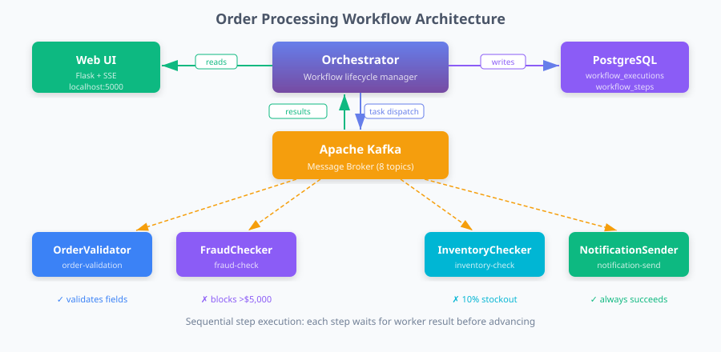

<div align="center">

# 🎯 Orquestador de Workflows

### Event-driven microservice orchestration with real-time monitoring

[](https://python.org)
[](https://kafka.apache.org)
[](https://postgresql.org)
[](https://flask.palletsprojects.com)
[](https://prometheus.io)
[](https://grafana.com)
[](https://docker.com)
[](ui/tests/)
[](LICENSE)

<br/>

A complete **event-driven orchestration platform** that coordinates 4 independent microservices through Apache Kafka, tracks every execution step in real time through a web dashboard, and observes the entire stack with Prometheus, Grafana, and Loki — all running locally with a single `docker compose up`.

</div>

---

## 📸 Screenshots

<table>
<tr>
<td width="50%">

**Workflow Execution List** — live status updates via SSE


</td>
<td width="50%">

**Step-by-Step Detail** — per-step status, duration & errors


</td>
</tr>
<tr>
<td width="50%">

**Grafana: Component Health** — all services at a glance


</td>
<td width="50%">

**4-Service Orchestration Flow** — how the workers connect



</td>
</tr>
</table>

---

## ✨ Features

| | Feature | Detail |
|---|---------|--------|
| 🔄 | **Workflow Orchestration** | State-machine lifecycle coordinator — Pending → Running → Completed/Failed |
| 🧩 | **4 Independent Workers** | OrderValidator · FraudChecker · InventoryChecker · NotificationSender |
| 📡 | **Real-time UI** | Flask + Server-Sent Events; falls back to 10 s polling; 30 s heartbeat watchdog |
| 📊 | **6 Grafana Dashboards** | Component health, workflow metrics, message rates, container resources, logs, alerts |
| 🔍 | **Centralized Logging** | Loki + promtail; JSON-structured logs; searchable by container, severity, or execution ID |
| 🚨 | **Infrastructure Alerts** | Prometheus rules for CPU/memory/disk (warning >80%, critical >90%); routed via Alertmanager |
| 🛡️ | **Idempotency & DLQ** | `processed_events` table prevents duplicate processing; `orchestration-dlq` topic for failures |
| ✅ | **23 Automated Tests** | Flask test-client + mocked DB; covers all routes, SSE, 503 error boundary, edge cases |
| 📐 | **JSON Schema Contracts** | 8 JSON Schemas (workflow definition, execution, 6 event types) from spec 003 |

---

## 🏗️ Architecture

```
                        ┌─────────────────────────────────────────┐
                        │        WORKFLOW ORCHESTRATION            │
                        │                                          │
  ┌──────────┐          │  ┌─────────────┐      ┌──────────────┐  │
  │  Web UI  │◄─reads──►│  │ Orchestrator│─task─►│   Workers   │  │
  │ :5000    │          │  │             │◄─res──│  (4 threads) │  │
  └──────────┘          │  └──────┬──────┘      └──────────────┘  │
                        │         │ writes                          │
  ┌──────────┐          │  ┌──────▼──────┐  ┌──────────────────┐  │
  │ Producer │─events──►│  │ PostgreSQL  │  │    Apache Kafka  │  │
  │          │          │  │             │  │  8 topics · DLQ  │  │
  └──────────┘          │  └─────────────┘  └──────────────────┘  │
  ┌──────────┐          └─────────────────────────────────────────┘
  │Consumer 1│
  │Consumer 2│          ┌─────────────────────────────────────────┐
  └──────────┘          │         OBSERVABILITY STACK              │
                        │  Prometheus · Grafana · Loki · promtail  │
                        │  Alertmanager · cAdvisor                 │
                        └─────────────────────────────────────────┘
```

### The Order Processing Workflow

Every 60 seconds the orchestrator starts a new execution with a random order. The 4 worker services process it sequentially through Kafka — each result is reflected in the UI within seconds.

```
┌──────────────────┐     ┌──────────────────┐     ┌──────────────────┐     ┌──────────────────┐
│  OrderValidator  │────►│   FraudChecker   │────►│InventoryChecker  │────►│NotificationSender│
│                  │     │                  │     │                  │     │                  │
│ Validates amount │     │ Blocks orders    │     │ Confirms items   │     │ Sends order      │
│ and item count   │     │ over $5,000      │     │ in stock         │     │ confirmation     │
│                  │     │ → DLQ on fail    │     │ 10% stockout     │     │ Always succeeds  │
└──────────────────┘     └──────────────────┘     └──────────────────┘     └──────────────────┘
```

This creates realistic mixed outcomes visible in the UI:

| Outcome | ~Frequency | Cause |
|---------|-----------|-------|
| ✅ All 4 steps green | 75% | Order ≤ $5,000 and stock available |
| ❌ Failed at FraudChecker | 15% | Order amount > $5,000 |
| ❌ Failed at InventoryChecker | 10% | Random stockout simulation |

---

## 🚀 Quickstart

### Prerequisites

```bash
docker --version        # Docker 24+
docker compose version  # Compose v2.20+
```

### 1. Clone and configure

```bash
git clone https://github.com/matiaspakua/orquestador_workflows.git
cd orquestador_workflows
cp .env.example .env
```

### 2. Start the full stack

```bash
docker compose up --build -d
```

Wait ~30 seconds for Kafka and PostgreSQL to initialise:

```bash
docker compose ps   # all services should show "healthy" or "running"
```

### 3. Open the interfaces

| Interface | URL | Credentials |
|-----------|-----|-------------|
| **Workflow Dashboard** | http://localhost:5000/workflows | — |
| **Grafana** | http://localhost:3000 | admin / admin |
| **Prometheus** | http://localhost:9090/targets | — |
| **Kafka UI** | http://localhost:8080 | — |
| **pgAdmin** | http://localhost:8081 | admin@event.com / admin123 |

### 4. Watch it run

After ~60 seconds, workflow executions start appearing in the dashboard. Each execution shows all 4 steps updating live. No page refresh needed.

---

## ⚙️ Configuration

All options are in `.env`:

```dotenv
# Database
POSTGRES_USER=eventuser
POSTGRES_PASSWORD=eventpass
POSTGRES_DB=eventdb

# Kafka
KAFKA_BROKER=kafka:29092
KAFKA_TOPIC=data-events
CONSUMER_GROUP=data-processors

# Producer — domain events interval (seconds)
PRODUCER_INTERVAL=5

# Orchestrator — new workflow every N seconds
WORKFLOW_INTERVAL=60
```

---

## 📊 Observability

### Grafana dashboards (pre-provisioned, no import needed)

| Dashboard | Key panels |
|-----------|-----------|
| **Component Health** | Health status per service, publish/consume rates, error trends |
| **Workflow Metrics** | Execution counts, p50/p95/p99 duration histogram, error rate over time |
| **Message Metrics** | Kafka publish/consume rates, consumer lag per partition |
| **Container Resources** | CPU %, memory %, disk I/O, network per container (cAdvisor) |
| **Log Explorer** | Full log stream with container and severity filters (Loki) |
| **Infrastructure Alerts** | Firing alerts table with severity badges, CPU/memory trends |

### Key metrics

```promql
# Is every service healthy?
health_status

# Workflow success rate
rate(orchestrator_workflows_completed_total{status="Completed"}[5m])
  / rate(orchestrator_workflows_completed_total[5m])

# p95 workflow duration
histogram_quantile(0.95, rate(orchestrator_workflow_duration_seconds_bucket[5m]))

# Consumer lag
consumer_lag
```

### Loki log queries

```logql
# Trace one workflow execution end-to-end
{container=~".+"} | json | workflow_execution_id = "<uuid>"

# All worker failures
{container="workers"} | json | level = "ERROR"

# Fraud checks that failed
{container="workers"} | json | message =~ "(?i)fraud"
```

---

## 🧪 Testing

### Unit + integration tests (UI layer)

```bash
cd ui && python3 -m pytest tests/ -v
# 23 tests · all routes · SSE · 503 error boundary · DB failure handling
```

### Full integration test suite (requires Docker)

```bash
docker compose -f docker-compose.test.yml up --build
# Tests: end-to-end message flow, error handling, orchestrator coordination, performance
```

---

## 📁 Project Structure

```
orquestador_workflows/
├── orchestrator/              # Workflow state machine (creates/tracks executions)
│   ├── app.py                 # Lifecycle management + Kafka task dispatch
│   ├── Dockerfile
│   └── requirements.txt
│
├── workers/                   # 4 worker services in one process
│   ├── app.py                 # OrderValidator · FraudChecker · InventoryChecker · NotificationSender
│   ├── Dockerfile
│   └── requirements.txt
│
├── producer/                  # Domain event generator (Faker → Kafka → PostgreSQL)
├── consumer/                  # Domain event processor (2 instances, idempotent)
│
├── ui/                        # Flask dashboard
│   ├── app.py                 # Routes: /workflows, /workflows/<id>, /api/workflows/stream (SSE)
│   ├── services/              # Parameterised DB queries with filter/pagination
│   ├── templates/             # base.html · workflow_list.html · workflow_detail.html
│   └── tests/                 # 23 pytest tests (mocked DB, all routes)
│
├── prometheus/                # Scrape config + recording rules + alert rules
├── grafana/provisioning/      # 6 dashboard JSONs + datasources (Prometheus + Loki)
├── loki/                      # 7-day log retention config
├── promtail/                  # docker_sd_configs → JSON pipeline stage
├── alertmanager/              # Webhook routing + inhibit rules
│
├── docs/
│   ├── workflow-lifecycle.md  # State machine + 10 validation rules
│   ├── step-types.md          # Task · Decision · Parallel · Wait
│   ├── event-flow.md          # Kafka event sequence + correlation guide
│   ├── loki-queries.md        # LogQL presets
│   ├── schemas/               # 8 JSON Schemas (workflow definition + 6 event types)
│   ├── examples/              # three-step-workflow.json reference example
│   └── screenshots/           # UI and dashboard screenshots
│
├── scripts/
│   ├── init-db.sql            # Core tables (event_data, event_logs)
│   ├── init-workflow-db.sql   # workflow_executions + workflow_steps
│   ├── init-idempotency.sql   # processed_events (dedup) + dead_letter_events
│   └── init-topics.sh         # Explicit Kafka topic creation (8 topics)
│
├── specs/                     # 5 feature specifications (001-005) — all complete
├── docker-compose.yml         # 14-service full stack
├── docker-compose.test.yml    # Integration test overlay
└── .env.example               # Configuration template
```

---

## 🛠️ Tech Stack

| Layer | Technology |
|-------|-----------|
| **Language** | Python 3.11 |
| **Messaging** | Apache Kafka 7.4.0 (kafka-python) |
| **Database** | PostgreSQL 15 (psycopg2) |
| **Web** | Flask 3.0 + Jinja2 + SSE |
| **Metrics** | Prometheus 2.51 + prometheus_client |
| **Dashboards** | Grafana 10.4 |
| **Logging** | Loki 2.9 + promtail + python-json-logger |
| **Alerts** | Alertmanager 0.27 |
| **Container metrics** | cAdvisor 0.49 |
| **Testing** | pytest 8.1 + Flask test client |
| **Container runtime** | Docker Compose v2 |

---

## 📐 Feature Specifications

All 5 features were designed spec-first and are fully implemented:

| # | Feature | Tasks | Status |
|---|---------|-------|--------|
| [001](specs/001-workflow-progress-ui/) | Workflow Progress UI | 39 | ✅ Complete |
| [002](specs/002-grafana-telemetry/) | Grafana Telemetry | 21 | ✅ Complete |
| [003](specs/003-workflow-definition/) | Workflow Definition Schemas | 26 | ✅ Complete |
| [004](specs/004-prometheus-monitoring/) | Prometheus Monitoring | 27 | ✅ Complete |
| [005](specs/005-producer-consumer-test/) | Integration Test Suite | 28 | ✅ Complete |

**141 tasks** across 5 specs — all implemented and tracked in `specs/*/tasks.md`.

---

## 🔒 Security Notes

- **`.env` is gitignored** — never commit it; use `.env.example` as the template
- Flask runs with `debug=False` by default (`FLASK_DEBUG=0`)
- Prometheus `/metrics` endpoints are on the internal Docker network only
- All Kafka messages use `enable_auto_commit=False` — offsets committed only on successful processing

---

## 📄 License

MIT — see [LICENSE](LICENSE)

---

<div align="center">

Built as a portfolio project demonstrating event-driven architecture, real-time observability, and spec-first development.

*Python · Kafka · PostgreSQL · Flask · Prometheus · Grafana · Loki · Docker*

</div>
