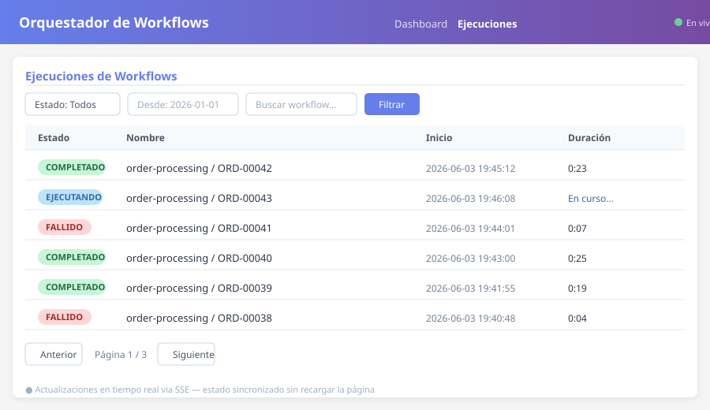
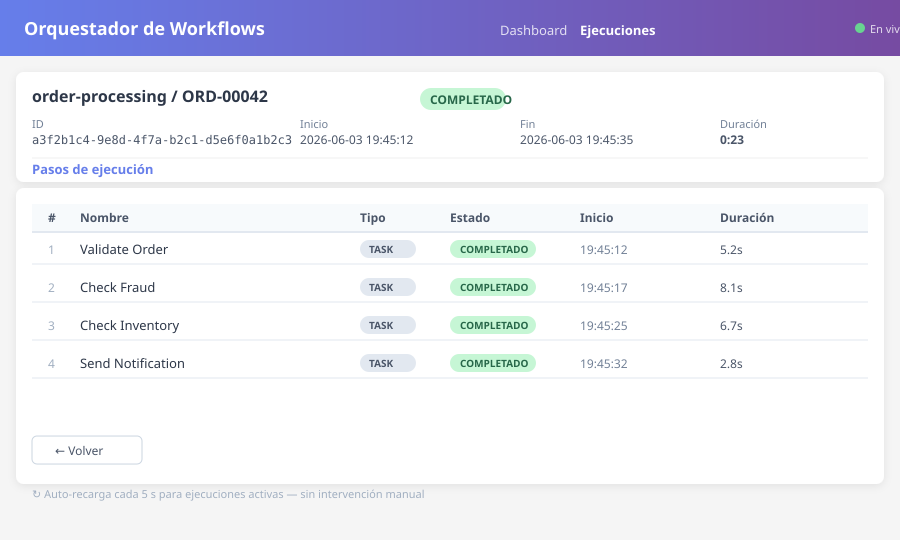
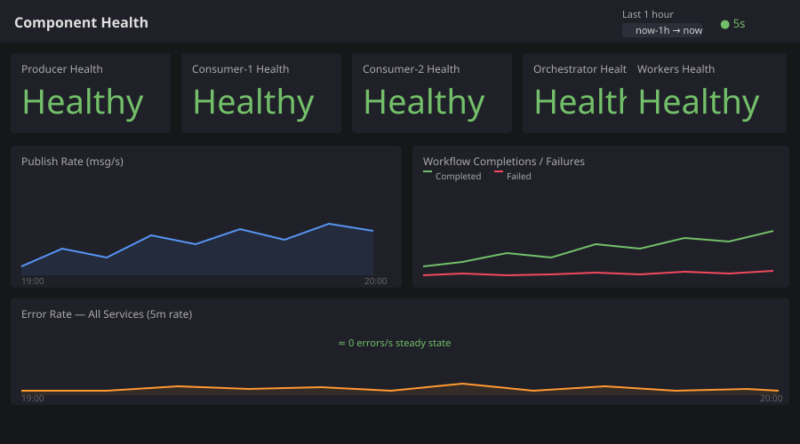

<div align="center">

# 🎯 Orquestador de Workflows

### Event-driven microservice orchestration with real-time monitoring

[](https://python.org)
[](https://kafka.apache.org)
[](https://postgresql.org)
[](https://flask.palletsprojects.com)
[](https://prometheus.io)
[](https://grafana.com)
[](https://docker.com)
[](https://grpc.io)
[](LICENSE)

<br/>

A complete **event-driven orchestration platform** that coordinates 4 independent microservices through Apache Kafka, tracks every execution step in real time through a web dashboard, and observes the entire stack with Prometheus, Grafana, and Loki — all running locally with a single `docker compose up`.

</div>

---

## ✨ Features

| | Feature | Detail |
|---|---------|--------|
| 🔄 | **Workflow Orchestration** | State-machine lifecycle coordinator — Pending → Running → Completed/Failed |
| 🧩 | **4 Independent Workers** | OrderValidator · FraudChecker · InventoryChecker · NotificationSender |
| 📡 | **Real-time UI** | Flask + Server-Sent Events; falls back to 10s polling; 30s heartbeat watchdog |
| 📊 | **6 Grafana Dashboards** | Component health, workflow metrics, message rates, container resources, logs, alerts |
| 🔍 | **Centralized Logging** | Loki + promtail; JSON-structured logs; searchable by container, severity, or execution ID |
| 🚨 | **Infrastructure Alerts** | Prometheus rules for CPU/memory/disk (warning >80%, critical >90%); routed via Alertmanager |
| 🛡️ | **Idempotency & DLQ** | `processed_events` table prevents duplicate processing; `orchestration-dlq` topic for failures |
| 🧪 | **Comprehensive Tests** | Unit tests, integration tests (REST + gRPC), Playwright E2E tests |
| 📐 | **gRPC & REST APIs** | Dual-protocol API: REST (Flask) + gRPC (port 50051) for workflow orchestration |
| ✅ | **30+ Automated Tests** | Flask test-client, mocked DB, gRPC stubs, Playwright browser tests |

---

## 🏗️ Architecture

```
                        ┌─────────────────────────────────────────┐
                        │        WORKFLOW ORCHESTRATION            │
                        │                                          │
  ┌──────────┐          │  ┌─────────────┐      ┌──────────────┐  │
  │  Web UI  │◄─reads──►│  │ Orchestrator│─task─►│   Workers   │  │
  │ :5000    │          │  │             │◄─res──│  (4 threads) │  │
  │ gRPC:50051│         │  └──────┬──────┘      └──────────────┘  │
  └──────────┘          │         │ writes                          │
                        │  ┌──────▼──────┐  ┌──────────────────┐  │
  ┌──────────┐          │  │ PostgreSQL  │  │    Apache Kafka  │  │
  │ Producer │─events──►│  │             │  │  8 topics · DLQ  │  │
  │          │          │  └─────────────┘  └──────────────────┘  │
  └──────────┘          └─────────────────────────────────────────┘
  ┌──────────┐
  │Consumer 1│          ┌─────────────────────────────────────────┐
  │Consumer 2│          │         OBSERVABILITY STACK              │
  └──────────┘          │  Prometheus · Grafana · Loki · promtail  │
                        │  Alertmanager · cAdvisor                 │
                        └─────────────────────────────────────────┘
```

---

## 🚀 Quickstart

### Prerequisites

```bash
docker --version        # Docker 24+
docker compose version  # Compose v2.20+
```

### 1. Clone and configure

```bash
git clone https://github.com/matiaspakua/orquestador_workflows.git
cd orquestador_workflows
cp .env.example .env
```

### 2. Start the full stack

```bash
docker compose up --build -d
```

Wait ~30 seconds for Kafka and PostgreSQL to initialise:

```bash
docker compose ps   # all services should show "healthy" or "running"
```

### 3. Open the interfaces

| Interface | URL | Credentials |
|-----------|-----|-------------|
| **Workflow Dashboard** | http://localhost:5001/workflows | — |
| **gRPC API** | localhost:50051 | — |
| **Grafana** | http://localhost:3000 | admin / admin |
| **Prometheus** | http://localhost:9090/targets | — |
| **Kafka UI** | http://localhost:8080 | — |
| **pgAdmin** | http://localhost:8081 | admin@event.com / admin123 |

### 4. Watch it run

After ~60 seconds, workflow executions start appearing in the dashboard. Each execution shows all 4 steps updating live. No page refresh needed.

---

## 🐣 Tutorial for Dummies — what is actually happening?

This section explains **everything** that happens when you run `docker compose up -d`. Read it
in order if you're new to microservices, Kafka, Docker, or just this project.

### What does `docker compose up -d` do?

It starts **17 containers** at once. Think of each container as a tiny computer inside
your computer. They are all connected by a virtual network called `event-network`.

```
┌──────────────────────────────────────────────────────────────────┐
│                     YOUR LAPTOP (localhost)                       │
│                                                                   │
│  ┌─────────┐  ┌─────────┐  ┌───────────┐  ┌───────────┐        │
│  │  Port   │  │  Port   │  │   Port    │  │   Port    │  ...    │
│  │  5001   │  │  3000   │  │   9090    │  │   8080    │         │
│  │  (Web)  │  │(Grafana)│  │(Prometheus)│  │(Kafka UI)│         │
│  └────┬────┘  └────┬────┘  └─────┬─────┘  └────┬─────┘         │
│       └───────┬────┘──────────────┴─────────────┘                │
│               ▼                                                   │
│   ┌──────────────────────┐                                       │
│   │  event-network       │  ← all containers talk here           │
│   │  (virtual network)   │                                       │
│   └──────────────────────┘                                       │
└──────────────────────────────────────────────────────────────────┘
```

Your browser connects to these ports to show you dashboards, logs, and graphs.
The containers themselves talk to each other on the internal network using
their **container names** (e.g. `kafka:29092`, `postgres:5432`) — you never
need to connect to those directly.

---

### The 3 parts of the system

| Part | What it does | Analogy |
|------|-------------|---------|
| **Data Pipeline** | Producer creates fake events → Kafka delivers them → Consumers process them | A conveyor belt in a factory |
| **Workflow Engine** | Orchestrator launches order workflows → Workers execute each step → Results go back | A project manager assigning tasks |
| **Observability Stack** | All services report metrics → Prometheus stores them → Grafana shows graphs → Loki stores logs | Security cameras + control room |

---

### Part 1 — The Data Pipeline (producer → Kafka → consumers)

This is the simplest part. It simulates a real company's event stream:

```
  ┌──────────┐     ┌──────────────────┐     ┌──────────────┐
  │ Producer │────►│  Apache Kafka    │────►│  Consumer 1  │
  │(fake data)│    │  ("data-events") │     │  Consumer 2  │
  └──────────┘     └──────────────────┘     └──────────────┘
       │                                       │
       ▼                                       ▼
  ┌──────────┐                           ┌──────────┐
  │PostgreSQL│                           │PostgreSQL│
  │event_data│                           │DLQ +     │
  │ table    │                           │processed │
  └──────────┘                           └──────────┘
```

**Step by step:**

1. **Producer** (``producer/app.py``) runs a loop. Every 5 seconds it invents a
   fake event — an order, a payment, a user signup, etc. — and writes it to
   PostgreSQL (``event_data`` table) AND sends its ID to Kafka topic
   ``data-events``.
   
2. **Kafka** receives the message. Kafka is just a middleman — a
   "message broker". It holds messages in ordered queues called **topics**.
   Think of it like a postal service: the producer drops a letter (message)
   into a mailbox (topic), and Kafka holds it until someone picks it up.
   
3. **Consumer 1 and Consumer 2** (``consumer/app.py``) are two instances of
   the same app, both subscribed to ``data-events`` as part of the
   ``data-processors`` **consumer group**. Kafka gives each message to only
   ONE consumer in the group — this is called **load balancing**. If one
   consumer crashes, the other picks up the slack.
   
4. Each consumer reads a message, processes it (pretends to update a database,
   send an email, etc.), and stores the result. It also writes to the
   ``processed_events`` table to make sure it never processes the same event
   twice (idempotency). If processing fails, the event goes to the
   ``dead_letter_events`` table for later inspection.

**What to check:**

| Tool | URL | What to look for |
|------|-----|-----------------|
| **Dashboard** | http://localhost:5001 | The top section shows "Events Stats" — total events, events per type, and consumer processing rates |
| **Kafka UI** | http://localhost:8080 | Click "Topics" → ``data-events`` to see messages piling up. Click "Consumers" → ``data-processors`` to see which consumer is handling each partition |
| **Grafana** | http://localhost:3000 | Open "Message Metrics" dashboard — you'll see publish/consume rates and consumer lag (how far behind the consumers are) |

---

### Part 2 — The Workflow Engine (orchestrator → workers → Kafka)

This is the heart of the project. It runs an **order processing pipeline** with 4 steps:

```
  ┌─────────────┐
  │ Orchestrator│  ← every 60 seconds, creates a new order
  └──────┬──────┘
         │
  ┌──────▼──────────────────────────────────────────────────────────┐
  │                 WORKFLOW (4 steps, run in sequence)             │
  │                                                                  │
  │  Step 1         Step 2          Step 3          Step 4          │
  │  ┌─────────┐   ┌─────────┐   ┌───────────┐   ┌──────────────┐  │
  │  │ Validate │→  │  Fraud  │→  │ Inventory │→  │ Notification │  │
  │  │  Order   │   │  Check  │   │  Check    │   │   Send       │  │
  │  └────┬────┘   └────┬────┘   └─────┬─────┘   └──────┬───────┘  │
  │       │             │              │                │           │
  │       │   Each publishes a task to a Kafka topic:    │           │
  │       └──→ "order-validation" ──┐                    │           │
  │           └──→ "fraud-check"   ─┤                    │           │
  │               └──→ "inventory-check" ─┐              │           │
  │                   └──→ "notification-send" ──────────┘           │
  │                                                                  │
  │   All workers send results back to "orchestration-results"      │
  └──────────────────────────────────────────────────────────────────┘
         │
         ▼
  ┌──────────────┐
  │  PostgreSQL  │
  │ executions   │
  │  + steps     │
  └──────────────┘
```

**Step by step:**

1. **Orchestrator** (``orchestrator/app.py``) waits 60 seconds, then creates a
   new **workflow execution** in PostgreSQL (``workflow_executions`` table) with
   status ``running``.
   
2. It starts **Step 1 — OrderValidator**. It publishes a task message to the
   Kafka topic ``order-validation``, and emits a lifecycle event to
   ``orchestration-events`` (topic used by the UI to show live updates).
   
3. **Workers** (``workers/app.py``) is a single container that runs **4 background
   threads**. Each thread listens to one Kafka topic:
   
   | Thread | Listens to topic | What it does | Can it fail? |
   |--------|-----------------|-------------|-------------|
   | ``order-validator`` | ``order-validation`` | Checks that order amount > 0 and fields are not empty | No |
   | ``fraud-checker`` | ``fraud-check`` | Flags orders over $5,000 as suspicious | Yes (>$5k) |
   | ``inventory-checker`` | ``inventory-check`` | 90% chance in stock, 10% chance out of stock | Yes (10%) |
   | ``notification-sender`` | ``notification-send`` | Pretends to send an email confirmation | No |
   
4. When a worker finishes, it publishes the **result** to ``orchestration-results``
   and the **lifecycle event** to ``orchestration-events``.
   
5. The **orchestrator** reads the result from ``orchestration-results``. If
   successful, it moves to the next step. If failed, the entire workflow is marked
   ``failed``. If all 4 steps succeed, it marks the workflow ``completed``.
   
6. Every status change is written to PostgreSQL and broadcast as a lifecycle
   event, which the Web UI picks up via **Server-Sent Events (SSE)** — this is
   why the dashboard updates in real time without refreshing.

**What to check:**

| Tool | URL | What to look for |
|------|-----|-----------------|
| **Dashboard → Workflows** | http://localhost:5001/workflows | A paginated list of every workflow execution with its status, steps, and duration. Click any row to see the 4 steps with their individual results |
| **Dashboard → Workflow Detail** | http://localhost:5001/workflows/1 | The 4 steps displayed in order. If the workflow is running, the page auto-refreshes. If it failed, you'll see which step failed and why |
| **Grafana** | http://localhost:3000 | Open "Workflow Metrics" dashboard — shows execution counts, duration histograms (p50/p95/p99), and error rate |
| **Kafka UI** | http://localhost:8080 | Browse topics ``orchestration-events``, ``orchestration-results``, and each worker topic to see every message flowing through |

---

### Part 3 — The Observability Stack (Prometheus + Grafana + Loki + cAdvisor + Alertmanager)

Every Python service in this project exposes a ``/metrics`` endpoint with
Prometheus-formatted data. The observability stack collects, stores, and
visualises this data.

```
  ┌─────────────────────────────────────────────────────────────────┐
  │                    THE OBSERVABILITY STACK                       │
  │                                                                  │
  │  ┌──────────┐     ┌────────────┐     ┌──────────────────┐      │
  │  │  Docker  │────►│  Promtail  │────►│      Loki        │      │
  │  │ Logs     │     │ (collector)│     │ (log storage)    │      │
  │  └──────────┘     └────────────┘     └────────┬─────────┘      │
  │                                                │                │
  │  ┌──────────┐     ┌────────────┐               │                │
  │  │  cAdvisor│────►│ Prometheus │               │                │
  │  │(resource│     │(metrics DB)│               │                │
  │  │ metrics)│     └──────┬─────┘               │                │
  │  └──────────┘           │                     │                │
  │                         ▼                     ▼                │
  │  ┌─────────────────────────────────────────────────────────┐   │
  │  │                     Grafana                             │   │
  │  │  http://localhost:3000 (admin / admin)                  │   │
  │  │  6 pre-built dashboards covering health, workflows,    │   │
  │  │  messages, containers, logs, and alerts                │   │
  │  └─────────────────────────────────────────────────────────┘   │
  │                                                                  │
  │  ┌──────────────┐                                                │
  │  │ Alertmanager │ ← Prometheus fires alerts when CPU > 80%      │
  │  └──────────────┘                                                │
  └──────────────────────────────────────────────────────────────────┘
```

#### Prometheus (http://localhost:9090)

Prometheus **scrapes** (pulls) metrics from every Python service every 15 seconds.

**Scrape targets:**

| Target | What it reports |
|--------|----------------|
| ``producer:8000/metrics`` | Messages published, publish rate, errors, health |
| ``consumer1:8000/metrics`` | Messages consumed, consumer lag, errors, health |
| ``consumer2:8000/metrics`` | Same as consumer1 |
| ``orchestrator:8000/metrics`` | Workflows started/completed, steps executed, duration |
| ``workers:8000/metrics`` | Tasks processed, processing time, health |
| ``web-ui:8000/metrics`` | HTTP requests, SSE connections, health |
| ``cadvisor:8080/metrics`` | CPU, memory, disk, network per container |

**What to check:** http://localhost:9090/targets — all targets should be "UP". Click
"Graph" and try a query like ``rate(messages_published_total[1m])`` to see the
publish rate.

#### Grafana (http://localhost:3000 — admin / admin)

Grafana reads from Prometheus and Loki to show 6 pre-built dashboards:

| Dashboard | What it shows |
|-----------|-------------|
| **Component Health** | Which services are up, publish/consume rates, errors over time |
| **Workflow Metrics** | How many workflows executed, how long they took (p50/p95/p99), failure rate |
| **Message Metrics** | Kafka publish and consume rates, consumer lag per partition |
| **Container Resources** | CPU %, memory %, disk I/O, and network for each Docker container |
| **Log Explorer** | All logs from every container, filtered by service or severity |
| **Infrastructure Alerts** | Any firing alerts (e.g. "CPU > 80% for 2 minutes") |

**What to check:** Open "Component Health" first — you'll see all services
reporting "Healthy". Then open "Workflow Metrics" — after a few minutes, you'll
see execution counts growing.

#### Grafana screenshots

| Workflow List | Workflow Detail | Grafana Health |
|:---:|:---:|:---:|
|  |  |  |

#### Loki + Promtail (logs)

Every Python service logs in **JSON format** (not plain text). Promtail reads the
Docker logs and sends them to Loki. Loki stores them and Grafana queries them.

**What to check:** In Grafana, open the "Log Explorer" dashboard. You can search
for a specific execution ID, filter by container name, or filter by severity
(INFO, WARN, ERROR).

#### cAdvisor (http://localhost:8082)

cAdvisor shows **live resource usage** for every container: CPU, memory, network,
and disk I/O. It refreshes every few seconds. This is useful when you want to see
which service is using the most resources.

**What to check:** http://localhost:8082/docker/ — you'll see a list of all
containers with real-time CPU/memory graphs.

#### Alertmanager

Prometheus has built-in alert rules:
- **CPU > 80% for 2 minutes** → Warning alert
- **CPU > 90% for 5 minutes** → Critical alert
- Same thresholds for memory and disk.

Alerts go to Alertmanager, which routes them to Grafana. You'll see them as
dashboard annotations in the "Infrastructure Alerts" dashboard.

---

### Recap — the full data flow

```
1. Producer ──event──► Kafka ("data-events") ──► Consumer 1/2
                                                      │
2. Orchestrator ──task──► Kafka ("order-validation") ──► Worker (validator)
   Orchestrator ◄──result── Kafka ("orchestration-results") ◄── Worker
                                                      │
3. Web UI ──SSE──► Kafka ("orchestration-events") ◄── Orchestrator
                                                      │
4. Every Python service ──/metrics──► Prometheus ──► Grafana
   Every Docker container ──logs──► Promtail ──► Loki ──► Grafana
```

In other words: **data flows left to right** through the pipeline, **results
flow back** through result topics, **live updates flow** through SSE, and
**everything is measured** by Prometheus and Loki.

---

### Checklist — verify everything is working

| # | Check | How |
|---|-------|-----|
| 1 | All containers running | ``docker compose ps`` — all 17 show "Up" or "Healthy" |
| 2 | Prometheus targets up | http://localhost:9090/targets — all targets "UP" |
| 3 | Workflows appearing | http://localhost:5001/workflows — shows workflow executions |
| 4 | Grafana has data | http://localhost:3000 → "Component Health" → panels show numbers |
| 5 | Kafka UI shows topics | http://localhost:8080 → Topics → all 8 topics exist |
| 6 | Logs are flowing | http://localhost:3000 → "Log Explorer" → pick a container → see log lines |

---

### Common questions

> **Why are there two consumer containers?**

For **load balancing and fault tolerance**. Both consumers are in the same
consumer group (``data-processors``). Kafka splits the ``data-events`` topic
into partitions and gives each partition to a different consumer. If one
consumer crashes, Kafka reassigns its partitions to the other. You can test
this by killing one consumer with ``docker compose stop consumer1`` — the
other instantly takes over.

> **Why is the Web UI on port 5001 and not 5000?**

macOS reserves port 5000 for AirPlay Receiver. The docker-compose file maps
``5001:5000`` to avoid conflicts.

> **What happens if a worker fails?**

The worker publishes an error to ``orchestration-dlq`` (dead letter queue).
The orchestrator marks that step as ``failed`` and the entire workflow becomes
``failed``. Future workflows are not affected — each execution is independent.

> **How do the workers run in a single container?**

``workers/app.py`` starts **4 Python threads**, each subscribed to a different
Kafka topic. They run in parallel in the same process. This keeps the
architecture simple — you only manage one container instead of four.

> **How do I reset everything?**

```bash
docker compose down -v   # stops all containers AND deletes volumes (DB, Kafka data)
docker compose up -d     # starts fresh
```

---

## 🧪 Testing

### Unit + Integration Tests

```bash
# Unit tests (no Docker)
python -m pytest ui/tests/ common/ tests_support/ -v --cov=ui/services --cov=common

# Full test suite
bash scripts/run-all-tests.sh

# E2E tests (requires running UI on localhost:5000)
E2E_TESTS=1 python -m pytest ui/tests_e2e/ -v

# gRPC + REST Integration
python -m pytest common/test_integration_grpc.py -v
```

### Docker Integration Test Suite

```bash
docker compose -f docker-compose.test.yml up --build
```

### Playwright E2E

```bash
pip install pytest-playwright
playwright install chromium
E2E_TESTS=1 python -m pytest ui/tests_e2e/ -v
```

---

## 📁 Project Structure

```
orquestador_workflows/
├── common/                    # Shared modules
│   ├── config.py              # Environment configuration
│   ├── db.py                  # Database connection pooling
│   ├── grpc_service.py        # gRPC server implementation
│   ├── grpc_stub.py           # gRPC client stub
│   ├── health.py              # Health check endpoints
│   ├── logging_setup.py       # JSON logging setup
│   └── test_*.py              # Shared unit tests
│
├── orchestrator/              # Workflow state machine
├── workers/                   # 4 worker services
├── producer/                  # Domain event generator
├── consumer/                  # Domain event processor
├── ui/                        # Flask dashboard + gRPC
│   ├── app.py                 # Routes + gRPC server
│   ├── services/              # Parameterised DB queries
│   ├── templates/             # Jinja2 templates
│   ├── tests/                 # Unit tests (mocked DB)
│   └── tests_e2e/             # Playwright E2E tests
│
├── proto/                     # Protocol Buffers definitions
├── prometheus/                # Scrape config + rules
├── grafana/provisioning/      # Dashboard JSONs
├── docs/                      # Documentation
├── scripts/                   # Init SQL, test runner
├── tests_support/             # Test helper library
└── .env.example               # Configuration template
```

---

## 📊 Observability

### Grafana dashboards (pre-provisioned)

| Dashboard | Key panels |
|-----------|-----------|
| **Component Health** | Health status per service, publish/consume rates, error trends |
| **Workflow Metrics** | Execution counts, p50/p95/p99 duration histogram, error rate |
| **Message Metrics** | Kafka publish/consume rates, consumer lag per partition |
| **Container Resources** | CPU %, memory %, disk I/O, network per container |
| **Log Explorer** | Full log stream with container/severity filters |
| **Infrastructure Alerts** | Firing alerts with severity badges |

---

## 🔒 Security Notes

- **`.env` is gitignored** — never commit it; use `.env.example` as the template
- Flask runs with `debug=False` by default (`FLASK_DEBUG=0`)
- Prometheus `/metrics` endpoints are on the internal Docker network only
- All Kafka messages use `enable_auto_commit=False` — offsets committed on successful processing
- gRPC runs on internal Docker network (port 50051)

---

## 📄 License

MIT — see [LICENSE](LICENSE)

---

<div align="center">

Built as a portfolio project demonstrating event-driven architecture, real-time observability, and spec-first development.

*Python · Kafka · PostgreSQL · Flask · Prometheus · Grafana · Loki · Docker · gRPC*

</div>
