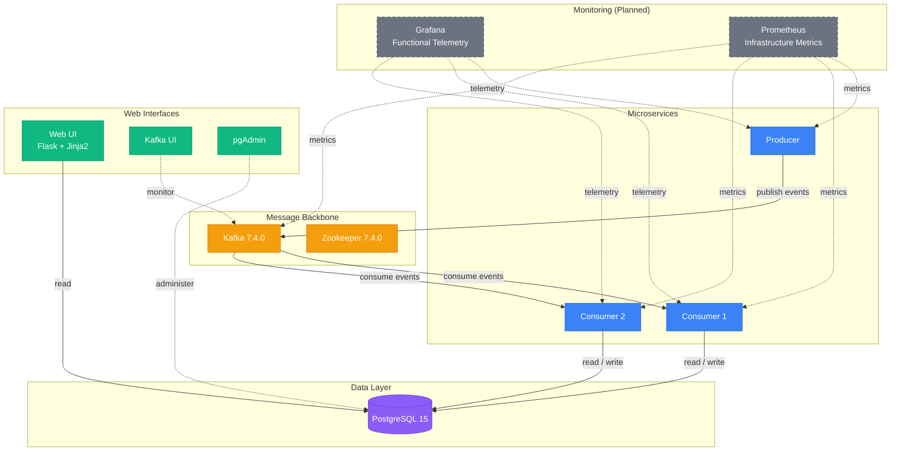
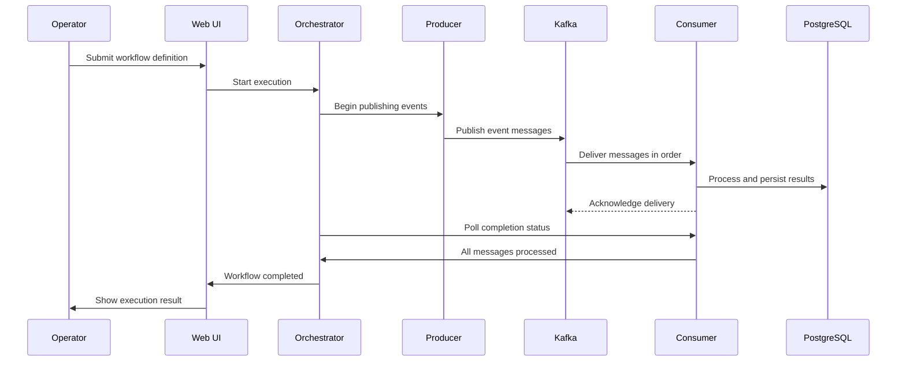

# Orquestador de Workflows

**Event-driven workflow orchestration system** — microservices communicating through Apache Kafka, coordinated by an orchestrator, with data persisted in PostgreSQL.

Built with **Python 3.11**, **Confluent Kafka 7.4.0**, **PostgreSQL 15**, and **Docker Compose**.

---

## Architecture



### Workflow Lifecycle



---

## Services

| Service | Role | Technology | Port |
|---------|------|------------|------|
| **producer** | Publishes workflow events to Kafka | Python 3.11, kafka-python | — |
| **consumer** (×2) | Consumes and processes events, persists results | Python 3.11, kafka-python | — |
| **web-ui** | Dashboard for operators to manage workflows | Python 3.11, Flask, Jinja2 | `5000` |
| **kafka** | Event backbone for inter-service communication | Confluent CP-Kafka 7.4.0 | `9092` |
| **zookeeper** | Kafka cluster coordination | Confluent CP-Zookeeper 7.4.0 | — |
| **kafka-ui** | Topic browser and message inspector | provectuslabs/kafka-ui | `8080` |
| **postgres** | Persistent data store | PostgreSQL 15 Alpine | `5432` |
| **pgadmin** | Database administration UI | dpage/pgadmin4 | `8081` |

### Planned

| Service | Role | Spec |
|---------|------|------|
| **Orchestrator** | Workflow lifecycle management, step coordination | `specs/003-workflow-definition/` |
| **Grafana** | Functional telemetry dashboards (workflow & message metrics) | `specs/002-grafana-telemetry/` |
| **Prometheus** | Infrastructure monitoring (CPU, memory, logs, alerts) | `specs/004-prometheus-monitoring/` |

---

## Features

| Feature | Status | Description |
|---------|--------|-------------|
| Core message pipeline | ✅ Live | Producer → Kafka → Consumer message flow |
| Workflow Definition | 📋 Spec | Workflow lifecycle, step types, event schema |
| Workflow Progress UI | 📋 Spec | Real-time workflow status dashboard |
| Grafana Telemetry | 📋 Spec | Functional metrics dashboards |
| Prometheus Monitoring | 📋 Spec | Infrastructure metrics, logs, alerts |
| Producer-Consumer Tests | 🚧 In Progress | Integration test suite (28 tasks across 6 phases) |

---

## Quick Start

```bash
# 1. Clone and configure
git clone <repo-url>
cd orquestador_workflows
cp .env.example .env

# 2. Start all services
docker-compose up -d

# 3. Verify everything is running
docker-compose ps

# 4. View logs
docker-compose logs -f
```

### Environment

```env
# PostgreSQL
POSTGRES_USER=eventuser
POSTGRES_PASSWORD=eventpass
POSTGRES_DB=eventdb

# Kafka
KAFKA_BROKER=kafka:29092
KAFKA_TOPIC=events
CONSUMER_GROUP=event-consumers

# Producer
PRODUCER_INTERVAL=5000    # ms between publishes
```

---

## Access Points

| Service | URL | Credentials |
|---------|-----|------------|
| Web UI | [http://localhost:5000](http://localhost:5000) | — |
| Kafka UI | [http://localhost:8080](http://localhost:8080) | — |
| pgAdmin | [http://localhost:8081](http://localhost:8081) | `admin@event.com` / `admin123` |

---

## Development

```bash
# Start with development overrides
docker-compose -f docker-compose.yml -f docker-compose.dev.yml up -d

# View service logs
docker-compose logs -f producer consumer1

# Rebuild a single service
docker-compose up -d --build producer
```

### Project Structure

```
orquestador_workflows/
├── consumer/          # Event consumer microservice
│   ├── app.py
│   ├── Dockerfile
│   └── requirements.txt
├── producer/          # Event producer microservice
│   ├── app.py
│   ├── Dockerfile
│   └── requirements.txt
├── ui/               # Web dashboard (Flask + Jinja2)
│   ├── app.py
│   ├── Dockerfile
│   ├── requirements.txt
│   └── templates/
├── scripts/          # Initialization and test scripts
├── diagrams/         # Architecture diagrams (PlantUML)
├── specs/            # Feature specifications
│   ├── 001-workflow-progress-ui/
│   ├── 002-grafana-telemetry/
│   ├── 003-workflow-definition/
│   ├── 004-prometheus-monitoring/
│   └── 005-producer-consumer-test/
├── docker-compose.yml
└── .env
```

---

## Testing

```bash
# Run the integration test suite
docker-compose -f docker-compose.test.yml up --build
```

The test suite validates:

- **End-to-end message flow** — producer → Kafka → consumer message delivery
- **Payload integrity** — consumed data matches published data exactly
- **Message ordering** — in-sequence delivery within a single partition
- **Error handling** — Kafka unavailability, invalid messages, network interruptions
- **Orchestrator coordination** — workflow start, completion, and cancellation

See `specs/005-producer-consumer-test/` for the full test specification and implementation plan.

---

## Monitoring

| Tool | Purpose | Access |
|------|---------|--------|
| **Kafka UI** | Browse topics, inspect messages, monitor consumer groups | `:8080` |
| **pgAdmin** | Query databases, inspect schema, manage data | `:8081` |
| **Logs** | Real-time log streaming per service | `docker-compose logs -f` |

### Planned

- **Grafana** — Functional telemetry: workflow execution rates, processing durations, message throughput, component health (`specs/002-grafana-telemetry/`)
- **Prometheus** — Infrastructure monitoring: CPU, memory, disk, network per container, centralized log search, configurable alerts (`specs/004-prometheus-monitoring/`)

---

## Constitution

This project follows a formal constitution defining non-negotiable standards for code quality, testing, UX, performance, and architecture. See `.specify/memory/constitution.md`.

---

## License

MIT
